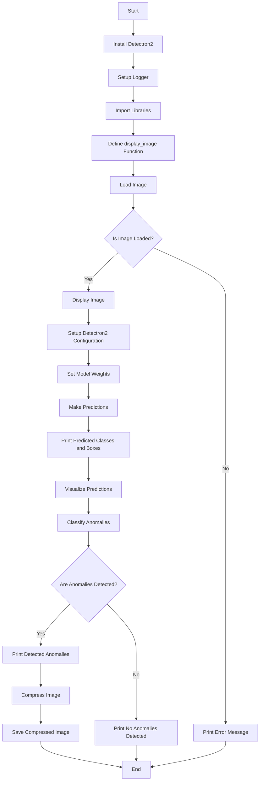

# VisionSecureframwork(VSF) :Advanced IoT Camera deep learning framework for Anomaly based  Lossless Compression


This project implements a state-of-the-art anomaly detection system using the **Detectron2** framework, a robust library for computer vision tasks. Designed for high-performance image analysis, this application detects anomalies, compresses images using deflate, and saves them, making it applicable in fields such as security, manufacturing, and quality control.
## Table of Contents
- [Introduction](#introduction)
- [Functionality](#functionality)
- [Features](#features)
- [Installation](#installation)
- [Usage](#usage)
- [Technologies Used](#technologies-used)
- [Code Structure](#code-structure)
- [License](#license)
- [Contributing](#contributing)
  
 ## Introduction

Anomaly detection is a critical task in many domains, including industrial inspection and security surveillance. This project leverages **Detectron2**, a cutting-edge object detection framework developed by Facebook AI Research (FAIR), to implement a highly effective anomaly detection system. By utilizing advanced neural network architectures and pre-trained models, we aim to achieve superior performance in identifying deviations from normal patterns in images.
## Functionality

### Flowchart
The flow of the program is outlined in the following flowchart:



### Key Functions
- **display_image()**: Function to load and display images.
- **Load Image**: Loads the specified image for analysis.
- **Setup Configuration**: Configures the Detectron2 model for predictions.
- **Make Predictions**: Runs the model on the loaded image to detect anomalies.
- **Classify Anomalies**: Analyzes the model's output to determine if anomalies are present.
- **Compress Image**: Compresses the image if anomalies are detected and saves the result.


## Features
- **Real-time Image Analysis**: Quickly analyze images for anomalies.
- **Advanced Model Configuration**: Utilize various state-of-the-art models for enhanced detection accuracy.
- **Robust Logging**: Comprehensive logging for debugging and performance monitoring.
- **Image Compression**: Automatically compress images post-anomaly detection to save storage.
- **Visualization**: Clear visualization of detected anomalies to aid in assessment.

## Installation

### Prerequisites
- Python 3.6 or later
- pip (Python package installer)

### Step 1: Clone the Repository
```bash
git clone https://github.com/kknani24/VisionSecureframwork(VSF)
cd anomaly-detection-detectron2
```

### Step 2: Install Required Packages
1. Install Detectron2 following the official [Detectron2 installation guide](https://github.com/facebookresearch/detectron2).
2. Install the required Python packages:
```bash
pip install -r requirements.txt
```

### Step 3: Verify Installation
Run the following command to ensure all packages are installed correctly:
```bash
python -c "import detectron2; print(detectron2.__version__)"
```

## Usage

1. **Load an Image**: Ensure you have an image you want to analyze in the project directory.
2. **Run the Anomaly Detection Script**:
```bash
python anomaly_detection.py --image_path path/to/your/image.jpg
```

3. **Check Output**: The output will display the original image with detected anomalies highlighted. If anomalies are detected, the program will compress the image and save it.

### Example Command
```bash
python anomaly_detection.py --image_path ./images/test_image.jpg
```


## Technologies Used

### Detectron2


Detectron2 is a state-of-the-art open-source library for object detection and segmentation tasks. It utilizes advanced architectures like **Mask R-CNN** and **RetinaNet**. In this code, it is used to predict and visualize object instances in images, allowing for efficient anomaly detection. The library's modular design also facilitates the integration of custom models and datasets.

### Python


Python is a versatile programming language widely used in data science and machine learning. It serves as the primary language for implementing the object detection workflow in this project. Its extensive ecosystem of libraries makes it a preferred choice for prototyping and development in AI applications.

### OpenCV


OpenCV is an open-source computer vision library that enables advanced image processing capabilities. In this project, OpenCV is utilized for reading, displaying, and manipulating images. Its efficiency in handling real-time image data is crucial for performance in object detection tasks.

### Deep Learning


Deep learning is a subset of machine learning that uses neural networks with many layers (deep networks) to analyze various data patterns. The models used in Detectron2 leverage deep learning techniques for accurate object detection. This allows the system to learn complex features directly from the data without manual feature engineering.

### Neural Networks


Neural networks are computational models inspired by the human brain, capable of recognizing complex patterns in data. They form the backbone of the models used in Detectron2, enabling effective image analysis. Their ability to generalize from training data enhances the accuracy of predictions on unseen data.

### Artificial Intelligence (AI)


AI involves the simulation of human intelligence in machines, allowing them to perform tasks that typically require human-like understanding and reasoning. This project employs AI techniques to enhance image processing and anomaly detection. As AI evolves, it continues to improve the efficiency and effectiveness of various applications across different domains.


## Code Structure

- `anomaly_detection.py`: Main script for loading images, detecting anomalies, and compressing images.
- `requirements.txt`: List of required Python packages for the project.
- `README.md`: Documentation for the project.


## License
This project is licensed under the MIT License. See the [LICENSE](LICENSE) file for details.

## Contributing
Contributions are welcome! Please feel free to submit a pull request or open an issue for any suggestions or improvements.


